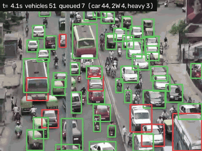
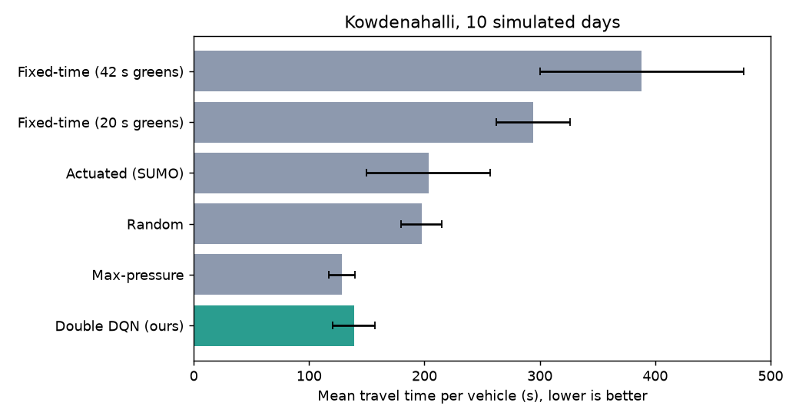
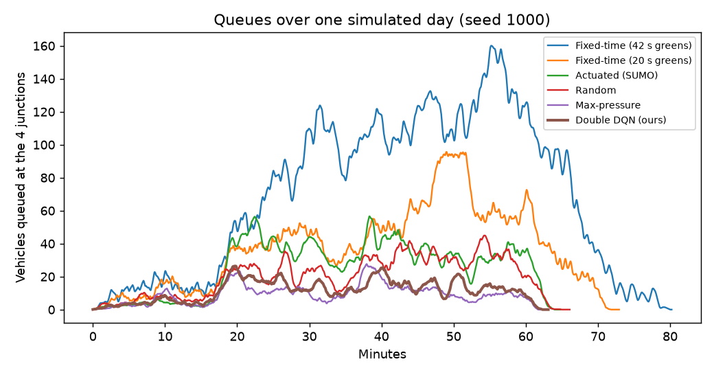
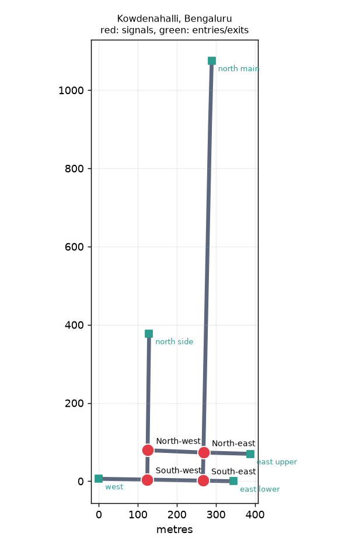
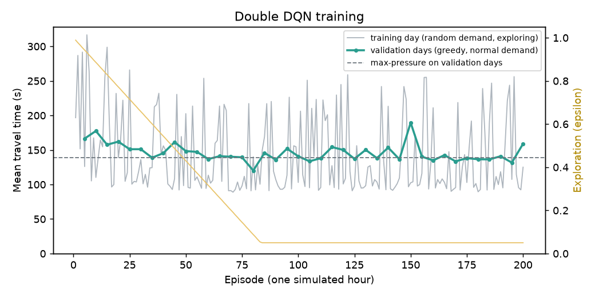

# JunctionIQ: Learning Traffic Signal Control for Bengaluru Junctions

[](https://github.com/imkarthiknr/Synchronous-Traffic-Light/actions/workflows/ci.yml)


JunctionIQ controls the traffic signals of four connected junctions in Kowdenahalli, Bengaluru. It has two parts:

1. **Vision:** counts vehicles and queues in road video with YOLOX and ByteTrack.
2. **Control:** learns when to switch the lights with a Double DQN in the SUMO traffic simulator, and is compared against the controllers a city would actually use.

This repository started as my 2021 college project, *Synchronous Traffic Light*. In 2026 it was rewritten from scratch as **JunctionIQ milestone 1**: one tested Python package with a command-line tool and reproducible results. See [What changed from 2021](#what-changed-from-2021).



## Results

All six controllers drove the same 10 simulated rush hours. That means the same vehicles, the same random seeds, and each day running until every vehicle had left. These days (seeds 1000–1009) were not used for training or for choosing the model.

| Controller | Mean travel time (s) | Mean stopped time (s) | Mean queue (veh) | Max queue (veh) | Unfinished |
| --- | ---: | ---: | ---: | ---: | ---: |
| Fixed-time, default plan (42 s greens) | 388.3 ± 88.1 | 173.8 ± 66.3 | 64.4 ± 19.1 | 168.8 | 16.1 |
| Fixed-time, tuned (20 s greens) | 294.2 ± 32.0 | 79.5 ± 9.3 | 32.6 ± 3.6 | 106.0 | 0.0 |
| Actuated (SUMO, gap-based) | 203.4 ± 53.5 | 66.3 ± 28.2 | 27.7 ± 9.9 | 95.2 | 0.0 |
| Random switching | 197.4 ± 17.4 | 45.9 ± 6.2 | 20.3 ± 2.9 | 64.3 | 0.0 |
| **Max-pressure** | **128.6 ± 11.5** | **23.3 ± 5.4** | **10.4 ± 2.5** | **42.4** | 0.0 |
| **Double DQN (this project)** | **138.9 ± 18.4** | 25.8 ± 6.5 | 11.5 ± 3.0 | 47.4 | 0.0 |

Mean ± standard deviation over the 10 days. "Unfinished" counts vehicles still stuck 30 minutes after the rush hour ended. Full per-day numbers are in [`results/`](results).

- The learned controller cuts the average trip by **53%** against the best fixed-time plan and by **32%** against SUMO's vehicle-actuated control, with queues 2–3 times shorter.
- **It does not beat max-pressure.** That simple rule, which has a stability guarantee, is about 8% better here; a small network with short links is where it shines. Beating it, and scaling beyond one joint action, are the goals of [milestone 2](ROADMAP.md).
- SUMO's actuated control is slow and inconsistent on this network: each junction extends its own green, and queues spill back over the 58 m link between the two eastern junctions. Changing its maximum green from 20 s to 60 s did not help.

| Travel time per controller | Queues through one rush hour |
| --- | --- |
|  |  |

Reproduce the table with the committed model in about two minutes:

```bash
uv run junctioniq evaluate --policies fixed fixed:20 actuated random max-pressure dqn \
  --model models/dqn-kowdenahalli.pt --seeds 1000-1009 --out results
```

## How it works



**Scenario.** The road network comes from OpenStreetMap: two parallel roads joined by two cross roads, with four signalised junctions. It's rebuilt for left-hand traffic. Each simulated day is a rush hour of about 1,800 vehicles. Cars, two-wheelers and trucks build up, then a peak comes in from the north, and later the flow turns round. Every seed gives a different but comparable day.

**Safe signals.** The agent can only *ask* a junction to change. A change happens after at least 10 s of green and always shows a 3 s yellow. The 2021 version set the lights directly every 2 seconds with no yellow at all.

**Learning.** Every 5 seconds the agent sees each approach lane's queue and occupancy plus each junction's current phase (38 numbers). It picks a green phase for all four junctions at once, which gives 16 joint actions. Its reward is minus the number of queued vehicles. Training ran 200 simulated hours at random demand levels (23 minutes on a 2-core CPU); the model that did best on two separate validation days was kept, from episode 80.



**Vision.** YOLOX finds vehicles in each frame and ByteTrack follows them. The camera's own panning and zooming is estimated from the background and subtracted. A vehicle that stays still on the road for a second counts as queued. With a fixed camera you can draw one zone per lane and get a queue per approach, which is the same kind of number the controller uses.

The full details, including observation, reward and evaluation protocol, are in [DEVELOPMENT.md](DEVELOPMENT.md).

<br clear="right">

## Quick start

You need Python 3.11+ and [uv](https://docs.astral.sh/uv/). SUMO is installed from PyPI, so there's nothing else to set up.

```bash
git clone https://github.com/imkarthiknr/Synchronous-Traffic-Light.git
cd Synchronous-Traffic-Light
uv sync --all-extras            # on a machine without an NVIDIA GPU: scripts/install_cpu.sh

uv run junctioniq simulate --policy max-pressure                                   # one rush hour
uv run junctioniq simulate --policy dqn --model models/dqn-kowdenahalli.pt --gui   # watch it
uv run junctioniq train --config configs/dqn.yaml --out runs/dqn                   # ~25 min on CPU
uv run junctioniq detect data/bangalore-traffic-15s.mp4 --out outputs/vision       # vision demo
```

| Command | What it does |
| --- | --- |
| `simulate` | Runs one day with one controller and prints the metrics; `--gui` opens SUMO's viewer |
| `train` | Trains the Double DQN; writes `training.csv`, `best.pt` and `last.pt` |
| `evaluate` | Compares controllers on the same days; writes a CSV, a Markdown table and plots |
| `detect` | Counts vehicles and queues in a video; writes a CSV, a summary and an annotated video |
| `build-network` | Rebuilds the SUMO network from the OSM extract |

## Project structure

```
src/junctioniq/
├── scenario.py              network rebuild and seeded traffic demand
├── scenarios/kowdenahalli/  OSM extract, SUMO network, scenario.yaml
├── sim/                     SUMO access, signal state machine, Gymnasium env, metrics
├── control.py               fixed-time, actuated, max-pressure, random and DQN policies
├── rl/                      Double DQN, replay buffer, training loop
├── evaluate.py              controller comparison, tables, plots
├── vision/                  YOLOX detector, camera-motion compensation, queues, pipeline
└── cli.py                   the junctioniq command
configs/    training configuration          models/   the published model
results/    the published evaluation        data/     15 s demo clip
docs/       figures                         tests/    pytest suite
```

## Testing

```bash
uv run pytest            # 43 tests, about 15 s, real SUMO simulations
uv run pytest -m model   # the detector on the demo clip (downloads YOLOX, 35 MB)
uv run ruff check .
```

CI runs the tests on Python 3.11 and 3.13 with a CPU-only PyTorch. It also checks that the committed network rebuilds identically from its OSM source, compares three controllers in a short simulation, and runs the detector on the demo clip.

## What changed from 2021

| 2021 | 2026 |
| --- | --- |
| Two folders of mostly copied code: darkflow YOLO (TensorFlow 1.x) and a Keras DQN | One package with a CLI, written from scratch: YOLOX on ONNX Runtime and a PyTorch Double DQN |
| A Windows SUMO install and a Python 3.6 virtualenv committed to the repo (5,625 files, about 500 MB) | SUMO and every dependency from PyPI, locked with uv |
| Hard-coded `C:\...` paths; run by editing scripts and typing `video` at a prompt | `junctioniq` commands with options and YAML configs |
| Lights switched every 2 s by setting the phase directly, with no yellow | A per-junction state machine with a 3 s yellow and a 10 s minimum green |
| DQN without a target network, fitted one sample at a time, judged on its own training run | Double DQN with batched updates, validation days for model selection, held-out test days |
| No baseline; results quoted as percentages from one run | Fixed-time, actuated, max-pressure and random baselines on the same 10 days |
| Right-hand traffic | Left-hand traffic, as in India |
| Counted cars, motorbikes and trucks per frame | Tracks each vehicle, compensates camera motion and counts queued vehicles, optionally per lane zone |
| No tests | 44 tests, Ruff and GitHub Actions |

The bundled code, SUMO and videos are still in the git history at commit `9afc6d2`.

## Credits

The 2021 version was built on two public 2018 projects: [traffic-annotation](https://github.com/muffyharsha/traffic-annotation), which used [darkflow](https://github.com/thtrieu/darkflow), and [TraffiQ-Control](https://github.com/strangest-quark/TraffiQ-Control). TraffiQ-Control is where the Kowdenahalli scenario and the queue-and-speed rewards came from. The current code shares no code with them.

Map data is © OpenStreetMap contributors (ODbL). The demo clip is from the original project team's Bengaluru footage. YOLOX is by Megvii (Apache-2.0), and SUMO is by the Eclipse Foundation (EPL-2.0). See [NOTICE.md](NOTICE.md).

## License

The code is [MIT](LICENSE) licensed. The OpenStreetMap-derived scenario files are under the ODbL, as described in [NOTICE.md](NOTICE.md).
